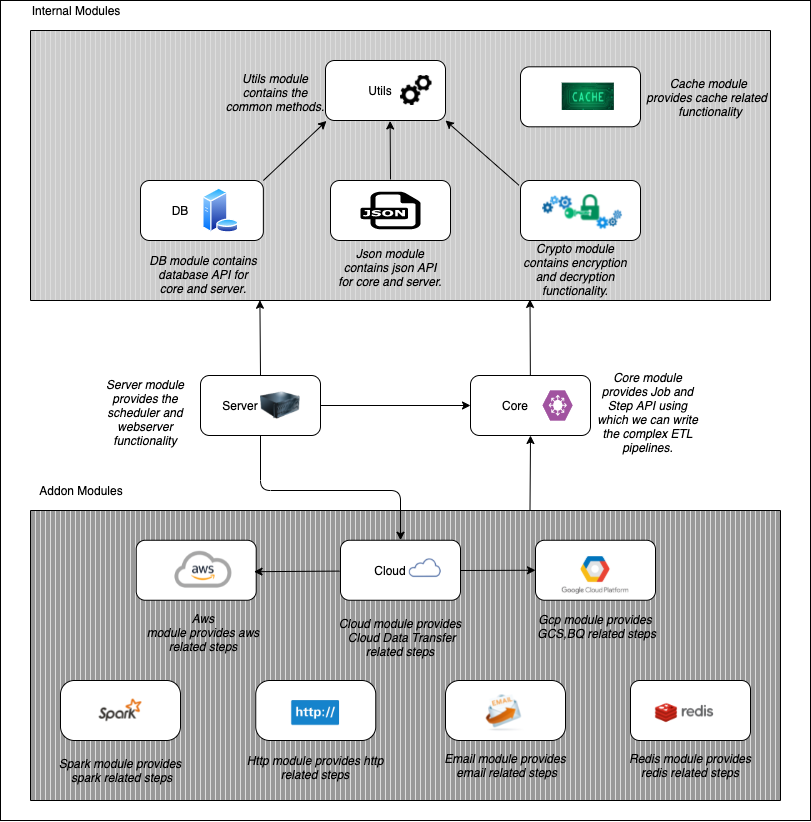

# EtlFlow

[](http://www.apache.org/licenses/LICENSE-2.0.txt)
[](https://github.com/tharwaninitin/etlflow/actions/workflows/ci.yml)
[](https://github.com/tharwaninitin/etlflow/actions/workflows/semver.yml)
[](https://mvnrepository.com/artifact/com.github.tharwaninitin/etlflow-core)
[](https://javadoc.io/doc/com.github.tharwaninitin/etlflow-core_2.12)

**EtlFlow** is an ecosystem of functional libraries in Scala based on ZIO for writing various different tasks, jobs on GCP and AWS.

## Documentation

__Library Documentation__  https://tharwaninitin.github.io/etlflow/site/docs

[comment]: <> (__Scala Test Coverage Report__  https://tharwaninitin.github.io/etlflow/testcovrep/)

## Examples
You can use this library in different ways mentioned below.
* [Core Module](examplecore):         
  Using this module you can use features of Task API into your project.
* [Spark Module (spark tasks)](examplespark):         
  Using this addon module along with core you can use Apache Spark tasks into your project.
* [GCP Module (spark tasks)](examplegcp):         
  Using this addon module along with core you can use GCP tasks into your project.

## Modules Dependency Graph



## Scala Version Compatibility Matrix
|  Module Name  | Scala 2.12 | Scala 2.13  | Scala 3.2  | 
|:-------------:|:----------:|:-----------:|:----------:|
|     Core      |     ✅      |      ✅      |     ✅      |
|      Db       |     ✅      |      ✅      |     ✅      |
|     Http      |     ✅      |      ✅      |     ✅      |
|     Email     |     ✅      |      ✅      |     ✅      |
|      Aws      |     ✅      |      ✅      |     ✅      |
|      Gcp      |     ✅      |      ✅      |     ✅      |
|     Redis     |     ✅      |      ✅      |     ❌      |
|     Spark     |     ✅      |      ✅      |     ❌      |

## Requirements and Installation
This project is compiled with scala versions 2.12.17, 2.13.9, 3.2.0
Available via [maven central](https://mvnrepository.com/artifact/com.github.tharwaninitin/etlflow-core).
Add the latest release as a dependency to your project

[](https://mvnrepository.com/artifact/com.github.tharwaninitin/etlflow-core)

__SBT__
```
libraryDependencies += "com.github.tharwaninitin" %% "etlflow-core" % "x.x.x"
libraryDependencies += "com.github.tharwaninitin" %% "etlflow-spark" % "x.x.x"
libraryDependencies += "com.github.tharwaninitin" %% "etlflow-cloud" % "x.x.x"
libraryDependencies += "com.github.tharwaninitin" %% "etlflow-http" % "x.x.x"
libraryDependencies += "com.github.tharwaninitin" %% "etlflow-redis" % "x.x.x"
libraryDependencies += "com.github.tharwaninitin" %% "etlflow-aws" % "x.x.x"
libraryDependencies += "com.github.tharwaninitin" %% "etlflow-gcp" % "x.x.x"
libraryDependencies += "com.github.tharwaninitin" %% "etlflow-email" % "x.x.x"
```
__Maven__
```
<dependency>
    <groupId>com.github.tharwaninitin</groupId>
    <artifactId>etlflow-core_2.12</artifactId>
    <version>x.x.x</version>
</dependency>
```

## Contributions
Please feel free to add issues to report any bugs or to propose new features.
