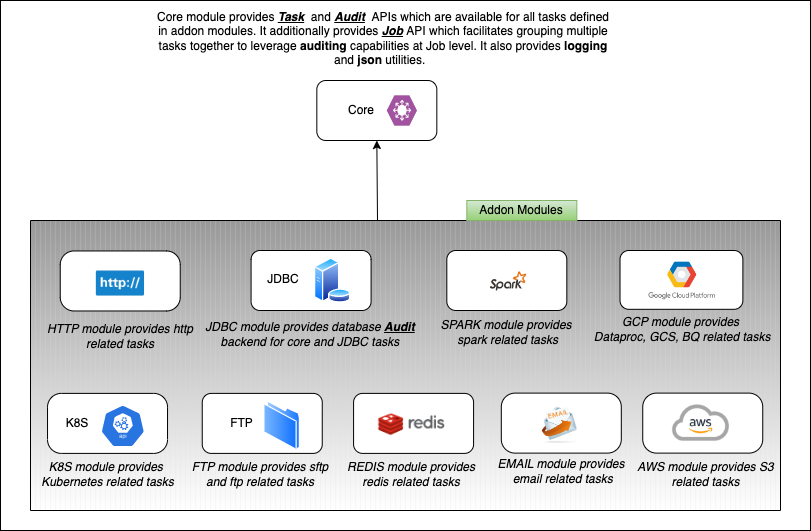

# EtlFlow

[](http://www.apache.org/licenses/LICENSE-2.0.txt)
[](https://github.com/tharwaninitin/etlflow/actions/workflows/ci.yml)
[](https://mvnrepository.com/artifact/com.github.tharwaninitin/etlflow-core)
[](https://javadoc.io/doc/com.github.tharwaninitin/etlflow-core_2.12)

**EtlFlow** is an ecosystem of functional libraries in Scala based on ZIO for running complex **_Auditable_** jobs/workflows which can interact with Google Cloud Platform, AWS, Kubernetes, Databases and more.

Below are some important features of this library, some of which come from ZIO.

- **Universal**. It provides a consistent way to interact with different services/products across cloud platforms like GCP, AWS, Azure, and On-Premises systems.
- **Functional**. Rapidly compose complex **jobs/workflows** from simple tasks.
- **Auditable**. Build jobs/workflows that provides auditability by default for multiple backends.
- **Resource-safe**. Build jobs/workflows that never leak resources (including threads!), even when they fail.
- **Compile Time DI**. Build jobs/workflows that allows resolving dependencies at compile time.
- **Fibers**. Built on non-blocking fibers that never waste or leak resources, which lets you build scalable, resilient, and reactive applications
- **Concurrent and Asynchronous**. Easily build concurrent asynchronous or synchronous jobs/workflows without deadlocks, race conditions, or complexity.
- **Type-safe**. Use the full power of the Scala compiler to catch bugs at compile time.
- **Testable**. Inject test services into your job/workflow for fast, deterministic, and type-safe testing.
- **Resilient**. Build jobs/workflows that never lose errors, and which respond to failure locally and flexibly.

[//]: # (__Library Documentation__  https://tharwaninitin.github.io/etlflow/site/docs)
[//]: <> (__Scala Test Coverage Report__  https://tharwaninitin.github.io/etlflow/testcovrep/)

## Examples
* [Core Module](examples/examplecore):         
  In this example project, you can explore core features of etlflow, Task and Audit API.
* [GCP Module (GCS, DataProc, BigQuery tasks)](examples/examplegcp):         
  In this example project, you can explore GCP tasks.
* [K8S Module (K8S tasks)](examples/examplek8s):         
  In this example project, you can explore different Kubernetes tasks.
* [Spark Module (Spark tasks)](examples/examplespark):         
  In this example project, you can explore different Apache Spark tasks.

## Modules Dependency Graph



| Module | Latest Version                                                                                                                                                                                         |                                                                                                                                                       Documentation | Scala Versions                                                                                                                                                                                           | Java Version | 
|--------|--------------------------------------------------------------------------------------------------------------------------------------------------------------------------------------------------------|--------------------------------------------------------------------------------------------------------------------------------------------------------------------:|----------------------------------------------------------------------------------------------------------------------------------------------------------------------------------------------------------|--------------|
| Core   | [](https://mvnrepository.com/artifact/com.github.tharwaninitin/etlflow-core)   |         [](https://javadoc.io/doc/com.github.tharwaninitin/etlflow-core_3) | [](https://index.scala-lang.org/tharwaninitin/etlflow/etlflow-core)    | Java 8 +     |
| GCP    | [](https://mvnrepository.com/artifact/com.github.tharwaninitin/etlflow-gcp)     |           [](https://javadoc.io/doc/com.github.tharwaninitin/etlflow-gcp_3) | [](https://index.scala-lang.org/tharwaninitin/etlflow/etlflow-gcp)       | Java 8 +     |
| JDBC   | [](https://mvnrepository.com/artifact/com.github.tharwaninitin/etlflow-jdbc)   |         [](https://javadoc.io/doc/com.github.tharwaninitin/etlflow-jdbc_3) | [](https://index.scala-lang.org/tharwaninitin/etlflow/etlflow-jdbc)    | Java 8 +     |
| Http   | [](https://mvnrepository.com/artifact/com.github.tharwaninitin/etlflow-http)   |         [](https://javadoc.io/doc/com.github.tharwaninitin/etlflow-http_3) | [](https://index.scala-lang.org/tharwaninitin/etlflow/etlflow-http)    | Java 11 +    |
| K8S    | [](https://mvnrepository.com/artifact/com.github.tharwaninitin/etlflow-k8s)     |           [](https://javadoc.io/doc/com.github.tharwaninitin/etlflow-k8s_3) | [](https://index.scala-lang.org/tharwaninitin/etlflow/etlflow-k8s)       | Java 8 +     |
| Email  | [](https://mvnrepository.com/artifact/com.github.tharwaninitin/etlflow-email) |       [](https://javadoc.io/doc/com.github.tharwaninitin/etlflow-email_3) | [](https://index.scala-lang.org/tharwaninitin/etlflow/etlflow-email) | Java 8 +     |
| AWS    | [](https://mvnrepository.com/artifact/com.github.tharwaninitin/etlflow-aws)     |           [](https://javadoc.io/doc/com.github.tharwaninitin/etlflow-aws_3) | [](https://index.scala-lang.org/tharwaninitin/etlflow/etlflow-aws)       | Java 8 +     |
| FTP    | [](https://mvnrepository.com/artifact/com.github.tharwaninitin/etlflow-ftp)     |           [](https://javadoc.io/doc/com.github.tharwaninitin/etlflow-ftp_3) | [](https://index.scala-lang.org/tharwaninitin/etlflow/etlflow-ftp)       | Java 8 +     |
| Redis  | [](https://mvnrepository.com/artifact/com.github.tharwaninitin/etlflow-redis) | [](https://javadoc.io/doc/com.github.tharwaninitin/etlflow-redis_2.12) | [](https://index.scala-lang.org/tharwaninitin/etlflow/etlflow-redis) | Java 8 +     |
| Spark  | [](https://mvnrepository.com/artifact/com.github.tharwaninitin/etlflow-spark) | [](https://javadoc.io/doc/com.github.tharwaninitin/etlflow-spark_2.12) | [](https://index.scala-lang.org/tharwaninitin/etlflow/etlflow-spark) | Java 8 +     |

## Requirements and Installation
This project is compiled with scala versions 2.12.17, 2.13.10, 3.3.0

Available via [maven central](https://mvnrepository.com/artifact/com.github.tharwaninitin/etlflow-core).
Add the below latest release as a dependency to your project

[](https://mvnrepository.com/artifact/com.github.tharwaninitin/etlflow-core)

__SBT__
```scala
libraryDependencies += "com.github.tharwaninitin" %% "etlflow-core" % "1.7.3"
libraryDependencies += "com.github.tharwaninitin" %% "etlflow-gcp" % "1.7.3"
libraryDependencies += "com.github.tharwaninitin" %% "etlflow-jdbc" % "1.7.3"
libraryDependencies += "com.github.tharwaninitin" %% "etlflow-spark" % "1.7.3"
libraryDependencies += "com.github.tharwaninitin" %% "etlflow-k8s" % "1.7.3"
libraryDependencies += "com.github.tharwaninitin" %% "etlflow-http" % "1.7.3"
libraryDependencies += "com.github.tharwaninitin" %% "etlflow-ftp" % "1.7.3"
libraryDependencies += "com.github.tharwaninitin" %% "etlflow-redis" % "1.7.3"
libraryDependencies += "com.github.tharwaninitin" %% "etlflow-aws" % "1.7.3"
libraryDependencies += "com.github.tharwaninitin" %% "etlflow-email" % "1.7.3"
```
__Maven__
```
<dependency>
    <groupId>com.github.tharwaninitin</groupId>
    <artifactId>etlflow-core_2.12</artifactId>
    <version>1.7.3</version>
</dependency>
```

# Etlflow Modules
<!-- TOC -->
- [Etlflow Modules](#etlflow-modules)
  - [Core](#core)
    - [Task API](#task-api)
    - [Audit API](#audit-api)
    - [Job API](#job-api)
  - [GCP](#gcp)
    - [Dataproc](#dataproc)
  - [JDBC](#jdbc)
  - [K8S](#k8s)
  - [Http](#http)
  - [Email](#email)
  - [Aws](#aws)
  - [Redis](#redis)
  - [Spark](#spark)
<!-- /TOC -->

## Core
The core module provides **Task** and **Audit** APIs, which are used by all tasks in different modules. It also provides a **Job** API that facilitates grouping multiple tasks together to leverage **auditing** and **logging** capabilities at the job/workflow level.
### Task API
Below is the simplest example of **creating** a **Task** and **running** it using EtlFlow.
This example uses the noop audit backend, which does nothing. This is useful when you want to test a task that requires an audit backend to be passed in.

```scala
libraryDependencies += "com.github.tharwaninitin" %% "etlflow-core" % "1.7.3"
```

```scala
import etlflow.audit.Audit
import etlflow.task.GenericTask
import zio._

object Job1 extends ZIOAppDefault {

  def executeTask(): Task[Unit] = ZIO.logInfo(s"Hello EtlFlow Task")

  val genericTask1: GenericTask[Any, Unit] = GenericTask(
    name = "Generic Task",
    task = executeTask()
  )

  val task1: RIO[Audit, Unit] = genericTask1.toZIO

  override def run: Task[Unit] = task1.provide(etlflow.audit.noop)
}
```
### Audit API
EtlFlow provides an auditing interface that can be used to track the execution of tasks and jobs (collections of tasks). 
The auditing interface is integrated with the Task Interface. 
Each task uses this interface to maintain the state of all tasks in the job/workflow in the backend of choice for end-to-end auditability. 
Currently, there are audit backend implementations available for BigQuery, MySQL, and Postgres. 
Audit has a simple and concise interface, which makes it quite easy to add any new backend.
```scala
libraryDependencies += "com.github.tharwaninitin" %% "etlflow-core" % "1.7.3"
libraryDependencies += "com.github.tharwaninitin" %% "etlflow-jdbc" % "1.7.3"
```
```scala
import etlflow.task.{GenericTask, DBQueryTask}
import etlflow.model.Credential.JDBC
import zio._

object Job2 extends ZIOAppDefault {
  
  private val task1 = GenericTask(
    name = "Generic Task 1",
    task = ZIO.logInfo(s"Task 1")
  )

  private val task2 = GenericTask(
    name = "Generic Task 2",
    task = ZIO.logInfo(s"Task 2")
  )

  val job = for {
    _ <- task1.toZIO
    _ <- task2.toZIO
  } yield ()

  private val cred = JDBC(sys.env("DB_URL"), sys.env("DB_USER"), sys.env("DB_PWD"), sys.env("DB_DRIVER"))

  override def run: Task[Unit] = job.provide(etlflow.audit.DB(cred))
}
```
Here's a snapshot of data for the `task_run` table after this job has run:

| task_run_id | job_run_id | task_name | task_type   | metadata | status  | created_at              | modified_at             |
|-------------|------------|-----------|-------------|----------|---------|-------------------------|-------------------------|
| 1           | 100        | Task 1    | GenericTask | {}       | SUCCESS | 2023-07-13 10:00:00 UTC | 2023-07-13 11:00:00 UTC |
| 2           | 100        | Task 2    | GenericTask | {}       | RUNNING | 2023-07-13 12:00:00 UTC | 2023-07-13 13:00:00 UTC |

### Job API
Job API enables grouping multiple tasks together for auditing capabilities at the job level, below is the example of creating a JobApp and running it using EtlFlow.
By default, it uses noop audit layer but here we are using JDBC layer to persist auditing information in database.
```scala
import etlflow._
import etlflow.audit.Audit
import etlflow.task._
import zio._

object MyJobApp extends JobApp {

  private val cred = JDBC(sys.env("DB_URL"), sys.env("DB_USER"), sys.env("DB_PWD"), sys.env("DB_DRIVER"))
  
  override val auditLayer: Layer[Throwable, Audit] = etlflow.audit.DB(cred)

  private val task1 = GenericTask(
    name = "Task_1",
    task = ZIO.logInfo(s"Hello EtlFlow Task")
  )

  def job(args: Chunk[String]): RIO[audit.Audit, Unit] = task1.toZIO
}
```

Here's a snapshot of data for the `job_run` and `task_run` table after this job has run:

| job_run_id | job_name | metadata | status  | created_at              | modified_at             |
|------------|----------|----------|---------|-------------------------|-------------------------|
| 1          | MyJobApp | {}       | SUCCESS | 2023-07-13 10:00:00 UTC | 2023-07-13 11:00:00 UTC |


| task_run_id | job_run_id | task_name | task_type   | metadata | status  | created_at              | modified_at             |
|-------------|------------|-----------|-------------|----------|---------|-------------------------|-------------------------|
| 1           | 1          | Task 1    | GenericTask | {}       | SUCCESS | 2023-07-13 10:00:00 UTC | 2023-07-13 11:00:00 UTC |

## GCP
```shell
# To run all below GCP examples set the GOOGLE_APPLICATION_CREDENTIALS environment variable to the location of the service account json key. 
export GOOGLE_APPLICATION_CREDENTIALS=/path/to/key.json
```
### Dataproc
```scala
import etlflow.task._
import gcp4zio.dp._
import etlflow.audit
import etlflow.audit.Audit
import zio._

val gcpProject: String = "GCP_PROJECT"
val gcpRegion: String  = "GCP_REGION"
val dpCluster: String  = "DP_CLUSTER"
val dpEndpoint: String = "DP_ENDPOINT"
val dpBucket: String   = "DP_BUCKET"

val createCluster = DPCreateTask("DPCreateTask", dpCluster, ClusterProps(dpBucket))
val deleteCluster = DPDeleteTask("DPDeleteTask", dpCluster)

val args      = List("1000")
val mainClass = "org.apache.spark.examples.SparkPi"
val libs      = List("file:///usr/lib/spark/examples/jars/spark-examples.jar")
val conf      = Map("spark.executor.memory" -> "1g", "spark.driver.memory" -> "1g")

val sparkJob = DPSparkJobTask("DPSparkJobTask", args, mainClass, libs, conf)

val programGCP: RIO[DPJob with DPCluster with Audit, Unit] = for {
  _ <- createCluster.toZIO
  _ <- sparkJob.toZIO
  _ <- deleteCluster.toZIO
} yield ()

val dpJobLayer = DPJob.live(dpCluster, gcpProject, gcpRegion, dpEndpoint)
val dpClusterLayer = DPCluster.live(gcpProject, gcpRegion, dpEndpoint)

programGCP.provide(dpJobLayer,dpClusterLayer,audit.noop)
```
Check [this](examples/examplegcp/src/main/scala/examples/Job1GCP.scala) for complete example.

## JDBC
```scala
// Todo
```

## K8S
This module depends on kubernetes official Java client library version 18.0.1
```scala
import etlflow.task._
import etlflow.k8s._
import etlflow.audit
import etlflow.audit.Audit
import zio._

val jobName: String = "hello"

val programK8S: RIO[K8S with Audit, Unit] = for {
  _ <- K8SJobTask(
    name = "CreateKubeJobTask",
    jobName = jobName,
    image = "busybox:1.28",
    command = Some(List("/bin/sh", "-c", "sleep 5; ls /etc/key; date; echo Hello from the Kubernetes cluster"))
  ).toZIO
  _ <- K8STrackJobTask("TrackKubeJobTask", jobName).toZIO
  _ <- K8SJobLogTask("GetKubeJobLogTask", jobName).toZIO
  _ <- K8SDeleteJobTask("DeleteKubeJobTask", jobName).toZIO
} yield ()

programK8S.provide(K8S.live(),audit.noop)
```
Check [this](examples/examplek8s/src/main/scala/examples/Job1K8S.scala) for complete example.
## Http
```scala
// Todo
```
## Email
```scala
// Todo
```
## AWS
```scala
// Todo
```
## Redis
```scala
// Todo
```
## Spark
```scala
// Todo
```

## Contributions
Please feel free to add issues to report any bugs or to propose new features.