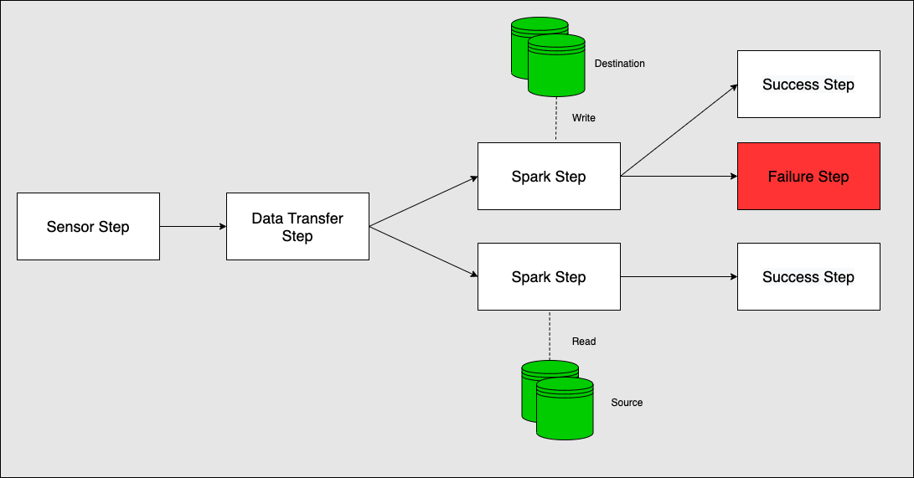

## Introduction

This library provides **plug-and-play steps** for Apache Spark, No SQL Databases(Redis, BigQuery etc), Relational Databases(Postgres, Mysql etc), Cloud Storage(S3, GCS etc) and multiple different libraries/datasources that makes it easier to develop **ETL applications** in **Scala** which can be easily Tested and Composed together. These **steps** are ready to handle various tasks on **Google Cloud Platform(GCP)** and **Amazon Web Services(AWS)**.

* **Job and Step Api** :
    This library provides job and step api using which we can write very complex ETL pipelines.

* **InBuilt Rest API** :
    Provides feature rich GraphQL api which is tightly integrated with core library, no need to install it separately as plugin. Jobs can be triggered externally for e.g. from GCP Cloud functions using this api.

* **InBuilt Logging** :
    Provides database and slack logging for detailed logging of each step inside job.

  
* **InBuilt Web-Server** :
    Server component in this libarary Provides basic UI like airflow which includes both scheduler and webserver, providing all basic functionality that airflow is providing.

  
* **Single Source Code** :
    All logic for entire job can be written in Scala including defining cron schedule, job properties and job definition.  

  
* **Many plug-and-play steps** :
    Provides many steps that are ready to handle your task on Google Cloud Platform(GCP) and Amazon Web Services(AWS).

  
* **Simple Custom Step API** :
    New custom steps can be added using very simple API.  

**Complex pipeline example using Etlflow library**

* **RAW SUCCESS FILE CHECK:**  Using GCSSensorStepGCS we can lookup for specified key in bucket repeatedly until it is
  found or fail after defined number of retries
* **S3-GCS DATA TRANSFER:** Using SparkReadWriteStep we can transfer the data from AWS to GCS. 
* **PARALLEL INGESTION:** Load transformed data into Big Query table using parallel step.  
* **SUCCESS/FAILURE NOTIFICATION:** Using HTTP/EMAIL step we can send the success or failure notifications/emails to other teams.