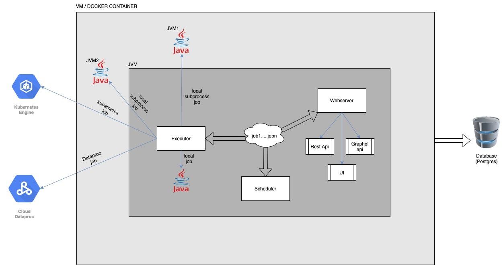

## Etlflow Server

Etlflow Server is one of component of etlflow library which we can be use for scheduling the etl jobs, creating the rest apis to trigger the jobs. Using etlflow Server component we can reduce the dependency of apache airflow as it itself provides the airlow like UI through its sub-component WEBSERVER.
Etlflow Server also provides the various operations to run the etl jobs on clusters like Local (Inside same jvm), LocalSubProcess (Inside another jvm)), GCP DataProc, Kubernetes etc.

### Etlflow Server library contains sub-components like :

* Scheduler : 
   - Using etlflow scheduler we can define the scheduled jobs by specifying the schedules at the time of job creation.
   - Once we define the schedules for etl jobs then jobs will run at the mentioned time.
   - Jobs can get submitted on dataproc, local, kubernetes based on the job props configuration.
   
* Webserver :
   - Webserver is the components where we can define the application end points using http4s and hence we can access the application through web browser.
   - By exposing the etlflow application through rest api, we can do job submission, check the job and step status etc.

* Executor :
   - Executor is the components where we can specify using which executor we can run etl job.
   - It contains executors such as : 
     * [Local](local.html)
     * [Local-Sub-Process](local_subprocess.html)
     * [DataProc](dataproc.html)
     * [Kubernetes](kubernates.html)
    

**Architecture Diagram :**




In above diagram we can see docker container is connected to database (postgres) which is getting used for storing all the etl jobs related information in database tables.

Below is the sample job will define the both services while job creation : 

To use etlflow Server library in project add below setting in build.sbt file : 

```

lazy val etlflowServer = ProjectRef(uri("git://github.com/tharwaninitin/etlflow.git#minimal"), "server")
lazy val docs = (project in file("modules/examples"))
  .dependsOn(etlflowServer)
         
```

### Define EtlJobProps
Here we can have any kind of logic for creating static or dynamic input parameters for job.
For e.g. intermediate path can be dynamically generated for every run based on current date.

```scala mdoc      
      
import etlflow.EtlJobProps
import java.text.SimpleDateFormat
import java.time.LocalDate
      
lazy val canonical_path = new java.io.File(".").getCanonicalPath
lazy val input_file_path = s"$canonical_path/modules/core/src/test/resources/input/movies/ratings_parquet/ratings.parquet"
val date_prefix = LocalDate.now.toString.replace("-","")
      
case class EtlJob1Props (
  ratings_input_path: String = input_file_path,
  ratings_intermediate_bucket: String = sys.env("GCS_BUCKET"),
  ratings_intermediate_file_key: String = s"temp/$date_prefix/ratings.parquet",
  ratings_output_dataset: String = "test",
  ratings_output_table_name: String = "ratings",
) extends EtlJobProps
```

### Define the EtlJob
Below is the example of GenericEtlJob which has two steps which can execute in any order defined by composing ZIO effects. 

```scala mdoc      
 
import com.google.cloud.bigquery.JobInfo
import etlflow.etljobs.GenericEtlJob
import etlflow.etlsteps.{BQLoadStep, GCSPutStep}
import zio.Task
import etlflow.utils.Config
import etlflow.spark.IOType
import etlflow.gcp.BQInputType
    
case class RatingOutput(user_id: Int, movie_id: Int, rating : Double, timestamp: Long, date: java.sql.Date)
    
case class EtlJob1(job_properties: EtlJob1Props) extends GenericEtlJob[EtlJob1Props] {
      
val step1 = GCSPutStep(
    name    = "LoadRatingGCS",
    bucket  = job_properties.ratings_intermediate_bucket,
    key     = job_properties.ratings_intermediate_file_key,
    file    = job_properties.ratings_input_path
)
          
val step2 = BQLoadStep(
    name                      = "LoadRatingBQ",
    input_location            = Left(s"gs://${job_properties.ratings_intermediate_bucket}/${job_properties.ratings_intermediate_file_key}"),
    input_type                = BQInputType.PARQUET,
    output_dataset            = job_properties.ratings_output_dataset,
    output_table              = job_properties.ratings_output_table_name,
    output_create_disposition = JobInfo.CreateDisposition.CREATE_IF_NEEDED
)
    
val job = for {
   _ <- step1.execute()
   _ <- step2.execute()
 } yield ()
}
```    

### Define the EtlJobPropsMapping : 

Below is the example of defining EtlJobPropsMapping where we can define the job name and its properties.

```scala mdoc

import etlflow.{EtlJobPropsMapping, EtlJobProps}
import etlflow.etljobs.EtlJob

sealed trait MyEtlJobPropsMapping[EJP <: EtlJobProps, EJ <: EtlJob[EJP]] extends EtlJobPropsMapping[EJP,EJ]

object MyEtlJobPropsMapping {
   case object Job1 extends MyEtlJobPropsMapping[EtlJob1Props,EtlJob1] {
     override def getActualProperties(job_properties: Map[String, String]): EtlJob1Props = EtlJob1Props()
   }
}
```

* RunServer

```scala mdoc
      
import etlflow.{ServerApp, EtlJobProps}
   
object LoadData extends ServerApp[MyEtlJobPropsMapping[EtlJobProps,EtlJob[EtlJobProps]]]
```

